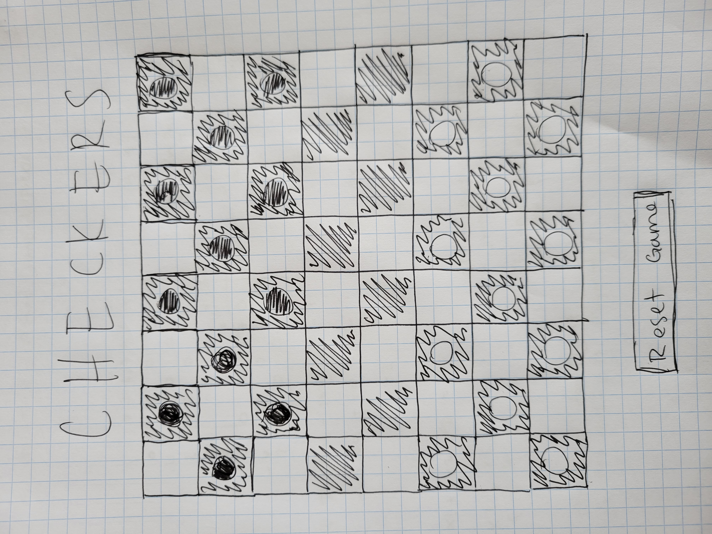

<link rel="images" href="images">

  <h1>:school_satchel: :school: Checkers :school: :school_satchel: </h1>
  <h3>https://prkrsamuels7.github.io/checkers/</h3>
  <h5>Parker Samuels</h5>`                             
  
   
  

<h1>:pencil: Description</h1>

Really awesome game of checkers!

 :art: Wireframes

| Description | Screenshot |
|------------ | ------------|
| <h3 align="center">Home Page</h3> | 

 :gear: Functionality

| Description | Screenshot |
|------------ | ------------|
| <h3 align="center">Main Game</h3> |  |

## :computer: Technologies Used

 

 

<h2> :atom_symbol: Getting Started </h2>

<h3> :calling: Instructions </h3>

Game Directions

<ol>
<li>Red starts the game, then turns alternate</li>
<li>Can only move and capture pieces diagonally</li>
</ol>

## :fast_forward: Next Steps   

### Upcoming Features

- [ ] Add 'King' functionality   

- [ ] Force jumps when available   

- [ ] Add double jump functionality 
